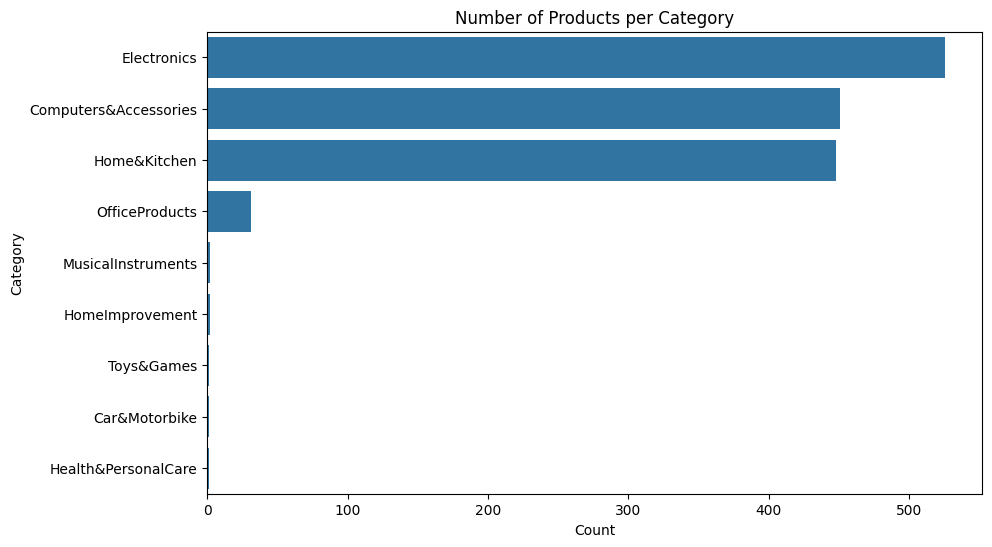
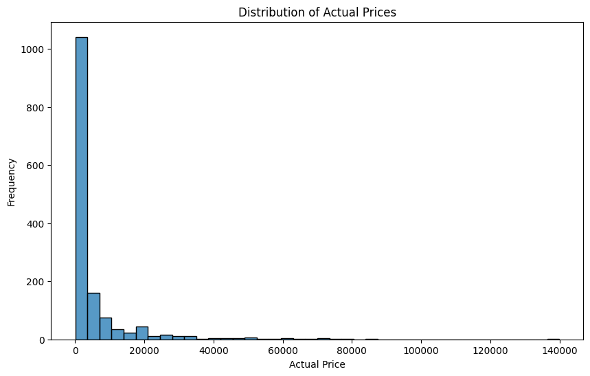
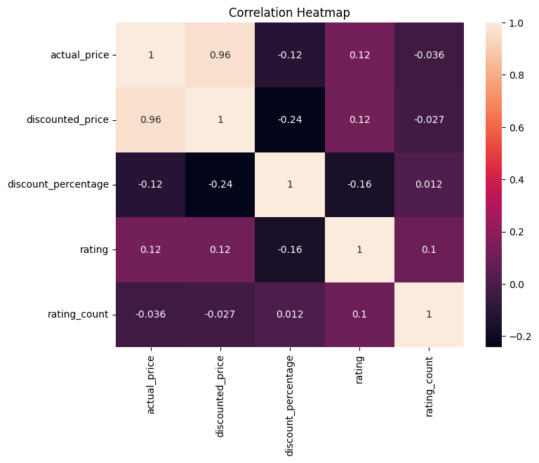

 # 📊 Amazon Sales Data Analysis & Visualization

## 🚀 Overview

An end-to-end Data Analytics & Visualization project analyzing Amazon product data to understand pricing patterns, discounts, popularity trends, and customer satisfaction.

The project follows an industry-style analytics workflow — transforming raw data into actionable business insights.

## 🔍 Key Insights

📦 Electronics dominate marketplace listings

💰 Prices show strong right-skew (budget-heavy marketplace)

🏷️ Discounts have minimal impact on ratings

⭐ Popularity ≠ product quality

📊 Discounting preserves pricing hierarchy

## ⚙️ Analytics Pipeline

𝐃𝐚𝐭𝐚 𝐂𝐥𝐞𝐚𝐧𝐢𝐧𝐠 → 𝐄𝐃𝐀 → 𝐕𝐢𝐬𝐮𝐚𝐥𝐢𝐳𝐚𝐭𝐢𝐨𝐧 → 𝐂𝐨𝐫𝐫𝐞𝐥𝐚𝐭𝐢𝐨𝐧 𝐀𝐧𝐚𝐥𝐲𝐬𝐢𝐬 → 𝐈𝐧𝐬𝐢𝐠𝐡𝐭 𝐄𝐱𝐭𝐫𝐚𝐜𝐭𝐢𝐨𝐧 → 𝐃𝐚𝐭𝐚 𝐒𝐭𝐨𝐫𝐲𝐭𝐞𝐥𝐥𝐢𝐧𝐠

## 🛠️ Tech Stack

𝐏𝐲𝐭𝐡𝐨𝐧 • 𝐏𝐚𝐧𝐝𝐚𝐬 • 𝐍𝐮𝐦𝐏𝐲 • 𝐌𝐚𝐭𝐩𝐥𝐨𝐭𝐥𝐢𝐛 • 𝐒𝐞𝐚𝐛𝐨𝐫𝐧 • 𝐉𝐮𝐩𝐲𝐭𝐞𝐫

## 📊 Project Preview

👉 After uploading images, replace paths like this:

## 📈 Skills Demonstrated

Data Cleaning & Preprocessing

Exploratory Data Analysis (EDA)

Statistical Interpretation

Data Visualization

Insight Extraction

Data Storytelling

## 📂 Repository Structure

amazon-sales-analysis/
│
├── amazon.csv
├── analysis.ipynb
├── visuals/
└── README.md

## 👤 Author

𝐎𝐣𝐚𝐬 𝐕𝐢𝐬𝐡𝐰𝐚 𝐌𝐨𝐡𝐚𝐧

Aspiring Data Scientist | Building Python & Analytics Projects
